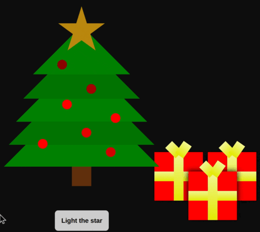

# 🎄 Day 23: Dinner at the Christmas Tree

*In the snowy North Pole, Santa Claus beamed with joy as he gazed at his gleaming sleigh. The elves had finished their work, every toy perfectly crafted and ready. Reindeer stood harnessed, bells jingling in the crisp air, Rudolf's nose shining brightly.*

*"Ho, Ho, Ho!" Santa chuckled, his heart brimming with happiness. His sleigh was more than a collection of gifts; it was a vehicle of joy, destined to deliver dreams to children worldwide. As he grasped the reins, anticipation bubbled within him. With a hearty "Onward!" the sleigh soared into the starlit sky, Santa's heart as light as the hope he spread on Christmas Eve.*

✨[*Vibe of the Day*](https://www.youtube.com/watch?v=zzzunYn6sUU)✨


---

## ⭐ Task 1: Who let him cook?

Santa is preparing a Christmas dinner in a cozy cabin in the woods.
He is preparing to serve the dish *Twenty-three Half-baked Toasty Majestic Lobsters*, or *23.html* as he likes to call it, and needs your help in the kitchen.

Download the file [23.html](../validator/assets/23.html), and serve it as a static file on the path `/assets/23.html`.

When done, opening <http://localhost:8000/assets/23.html> in the browser should show you the HTML page with a Christmas tree and some presents.

NOTE: To make static assets available when deploying to Shuttle, be sure to configure [build.assets](https://docs.shuttle.dev/docs/files#build-assets) in `Shuttle.toml`.

### 🔔 Tips

- [Shuttle examples: Axum static files](https://github.com/shuttle-hq/shuttle-examples/tree/main/axum/static-files)
- [Shuttle examples: Actix Web static files](https://github.com/shuttle-hq/shuttle-examples/tree/main/actix-web/static-files)
- [Shuttle examples: Rocket static files](https://github.com/shuttle-hq/shuttle-examples/tree/main/rocket/static-files)

---

## ⭐ Task 2: I thought this was a Rust challenge...?

*The time has come to decorate the Christmas tree in the cabin, or more precisely, add the magic touch of Christmas joy!*

The HTML file uses [htmx](https://htmx.org/), and is waiting for some server-side rendered HTML components to run the show.

Implement GET `/23/star` so that the star lights up when the button is clicked (the button's logic for sending the request is already implemented).
The star is lit by returning an HTML `<div>` element identical to the existing star element, but with the `lit` CSS class added.

### 🔔 Tips

- You should NOT modify *23.html*, all logic needed to get started is already in there. Reading its contents is **highly recommended** though!
- [htmx docs](https://htmx.org/docs/) is your friend.
- [W3 schools: HTML class attribute](https://www.w3schools.com/html/html_classes.asp)

### 💠 Example

Check the example for Task 4 to see how everything should behave when finished!

---

## ⭐ Task 3: Where is the JavaScript onClick?!

*Santa observes that all the presents under the tree have the same color.*
*With his magic touch and your help, let's add some color variety to this happy occasion!*

In a similar fashion as Task 1, add GET `/23/present/{color}` that responds with a new present element with the requested color.
Clicking on a present should change its color in the order `red` -> `blue` -> `purple` -> `red`, and so on.
The logic for getting the next color on the next click is achieved by correctly setting the `hx-get` value to get the next color.

If the color in the request is invalid, return a `418 I'm a teapot`.

---

## ⭐ Task 4: Where is the CSS animation-iteration-count?!

*Santa thinks that filling the Christmas tree with glitter is too sharp on his eyes these days.*
*Instead, he went and got himself some "fading" red ornaments that gives the tree a cozy vibe.*

Add GET `/23/ornament/{state}/{n}` that returns ornament number `n` in the requested `state`.

- `n` might not always be a number, so treat it like a string.
- The state is either `on` or `off`, and just like in Task 3, the next state needs to be referenced in the returned element. Only if the state is `on` should the element have the CSS class `on` added.
  - Like before, return `418` if the state is invalid.
- The hx-trigger `delay` property should have the value `2s` in all cases.

### 💠 Example

This is what the page should look like when Tasks 2, 3, and 4 are done!



---

## ⭐ Task 5: Xtra Spicy Soup 😱

*Santa remembers that the elves can be a little careless (or mischievous?) in the kitchen when adding chili flakes to the fish soup served alongside the lobster.*
*Make sure they don't overheat any web servers or user machines with the amount of spice they add.*

Ensure that all endpoints in this challenge are resistant to XSS attempts by HTML-escaping any incoming strings.

### 🔔 Tips

- Templating libraries usually come with escaping built-in in some way.

### 💠 Example

```bash
# Without escaping
curl "http://localhost:8000/23/ornament/on/%22%3E%3Cscript%3Ealert%28%22Spicy%20soup%21%22%29%3C%2Fscript%3E"
<div class="ornament on" id="ornament"><script>alert("Spicy soup!")</script>...

# With escaping
curl "http://localhost:8000/23/ornament/on/%22%3E%3Cscript%3Ealert%28%22Spicy%20soup%21%22%29%3C%2Fscript%3E"
<div class="ornament on" id="ornament&quot;&gt;&lt;script&gt;alert(&quot;Spicy soup!&quot;)&lt;/script&gt;"...
```

---

## 🎁 Task 6: cargo bake me a cake (100 bonus points)

*Santa thanks you for all the help with the Christmas tree!*
*The only thing remaining now for peace and joy during the holidays is finishing this Christmas dinner off with some cake!*

Santa has an interesting way to arrange the sprinkles on each cake to make them somewhat unique and interesting.
If you didn't notice yet, scrolling down the page in *23.html* reveals a form where you can upload a `Cargo.lock` file.

The form uses `hx-post` to send a multipart POST request to `/23/lockfile` with a `lockfile` field.
Implement this endpoint so that it, for every package in the lockfile that has a checksum, returns an HTML element with styles based on the checksum value:

```html
<div style="background-color:{color};top:{top}px;left:{left}px;"></div>
```

The values are calculated like this:

- `color` is the first 3 bytes in the checksum, turned into a hex color code.
- `top` is the following byte, converted to decimal.
- `left` is the following byte, converted to decimal.

All the other CSS has been prepared for you in advance by Santa.

- If anything goes wrong when parsing the multipart form or lockfile, return `400`.
- If any required characters in a checksum string are missing or invalid, return `422`.

### 💠 Example

With this (simplified) Cargo.lock file...

```toml
[[package]]
name = "shuttle-runtime"
version = "0.49.0"
source = "registry+https://github.com/rust-lang/crates.io-index"
checksum = "337789faa0372648a8ac286b2f92a53121fe118f12e29009ac504872a5413cc6"

[[package]]
name = "shuttle-service"
version = "0.49.0"
source = "registry+https://github.com/rust-lang/crates.io-index"
checksum = "22ba454b13e4e29b5b892a62c334360a571de5a25c936283416c94328427dd57"
```

...the endpoint should produce:

```html
<div style="background-color:#337789;top:250px;left:160px;"></div>
<div style="background-color:#22ba45;top:75px;left:19px;"></div>
```

---

Author: [jonaro00](https://github.com/jonaro00)
